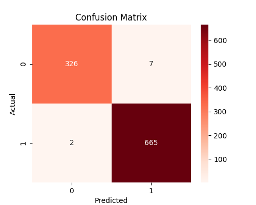
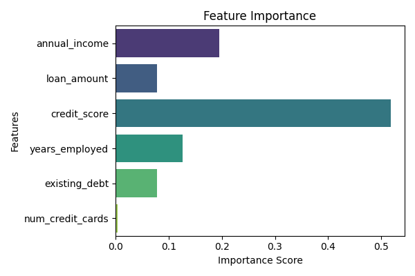

# AI Credit Risk Scoring System

An machine learning system for real-time credit risk prediction.
## Live Demo

👉 **Try the app here:**  
https://credit-risk-ml-api-35w58ymlamuvxt5htskdv5.streamlit.app

## Overview

This project demonstrates:

• Synthetic financial data generation  
• XGBoost classification model  
• Model evaluation (Accuracy, Precision, Recall, F1)  
• Confusion matrix visualization  
• Feature importance analysis  
• FastAPI backend  
• Streamlit interactive frontend  

## Architecture

Data Generation → Model Training → Saved Model (.pkl)  
→ FastAPI REST API → Streamlit UI  

## Features

- Real-time credit risk prediction
- Risk probability score
- Confusion matrix visualization
- Feature importance chart
- Clean API documentation via Swagger

## Tech Stack

- Python
- XGBoost
- FastAPI
- Streamlit
- Scikit-learn
- Seaborn
- Matplotlib

## How to Run

1. Create virtual environment  
2. Install dependencies  
3. Train model  
4. Start backend  
5. Launch frontend  

## Application Screenshots

### Model Evaluation

## System Architecture

